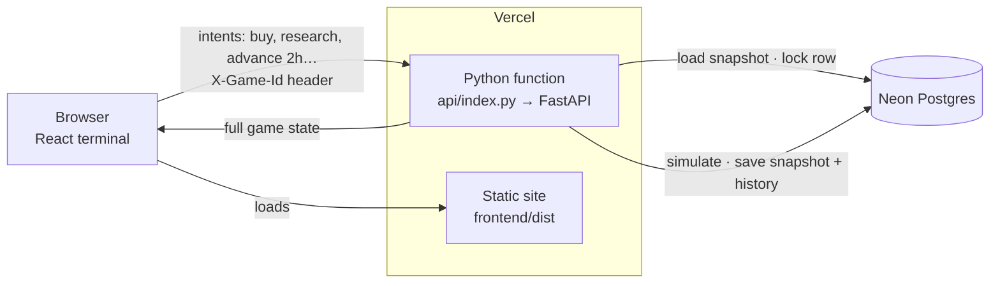

# Investment Banker Mode

> **Your decisions move the money. The market decides your fate.**

A financial career-management game. You join **Apex Capital** as Head of Investments with **₹100 Cr**, a
**₹112 Cr quarterly target**, a **10% drawdown limit** and **90 days**. The market is simulated hour by hour
on an Indian-style exchange. Your trades, your time, your risk calls and your conduct decide whether you are
promoted, warned or fired.

### ▶ [Play it in your browser: fin-sim-investments.vercel.app](https://fin-sim-investments.vercel.app)

No install or sign-up is needed. Your career saves automatically in the browser you play in.

📘 **New to the game?** Read the illustrated field manual: [docs/IB-Mode-How-To-Play.pdf](docs/IB-Mode-How-To-Play.pdf).
It covers the terminal, time, trading, research, risk, block deals, the team, the quarterly review and a
first-week playbook.

> **This is a game.** Every company, index, price, person and news event is fictional and generated by the
> simulation. Nothing here is live market data or financial advice. Names were chosen to avoid real
> companies and index trademarks: the benchmark is **BHARAT 50**, not a real index; the exchange is the
> fictional **Dalal Street Exchange (DSX)**.

---

## Built with

| Layer | Technology | Used for |
|---|---|---|
| Frontend | **React 18**, **TypeScript 5.6**, **Vite 5** | Single-page trading terminal |
| Styling | **Tailwind CSS 3**, lucide-react icons | Dark terminal UI, illustrated vector characters |
| Charts | **lightweight-charts 4** | Live candlesticks, SMA/EMA/Bollinger, RSI, MACD, ATR |
| Backend | **Python**, **FastAPI**, **Pydantic 2** | Authoritative game server and REST API |
| Simulation | **NumPy** | Multi-factor market model, events, risk, career scoring |
| Database | **PostgreSQL** (Neon), **SQLAlchemy 2** | Game snapshots, price history, news, saves, telemetry |
| ML | **scikit-learn**, joblib (XGBoost/SHAP optional) | Player-behaviour classifier, trained offline on bot play |
| Hosting | **Vercel** | Static frontend + one Python serverless function |
| Testing | **pytest**, **Vitest**, Testing Library | 40 backend and 10 frontend tests |

---

## How it works



**The server is the single source of truth.** The browser never computes prices, fills, P&L or outcomes.
It sends an *intent* (buy 4,000 AKSH, run a deep dive, skip 2 hours) and renders the state that comes back.

**One request, start to finish:**

1. The browser sends the request with its game id in the `X-Game-Id` header.
2. The game service opens a database session and locks that game's row (`SELECT … FOR UPDATE`), so two
   actions on the same game can never interleave, even if they land on different serverless instances.
3. The game's snapshot (≈50 KB of JSON) is loaded and validated into a Pydantic `GameState`. This takes about 2 ms.
4. The engine applies the action. Advancing time runs every hour through the same hooks: twelve
   5-minute market ticks, events, news, risk checks, team reactions, and the CEO and the review at quarter end.
5. The new snapshot and the history it produced (candles, news, transactions, events) are written back in
   one transaction, and the full updated state is returned to the browser.

**Persistence.** Every action autosaves, so refreshing the page or a cold-started server resumes exactly
where you were. The random-number generator's state is saved too, so a seed always reproduces its market.
Named save slots snapshot the game and roll history back consistently when loaded.

**Serverless mode.** On Vercel `api/index.py` sets `SERVERLESS=1`. That turns off the per-process state
cache, which would go stale across instances. It also switches to unpooled connections and creates tables on
cold start. Run as a normal long-lived server, the backend keeps a write-through in-memory cache instead.

**Live mode.** The ▶ LIVE button (1×, 2×, 4×) makes the browser request one hour at a time on a timer. The
server returns each hour's tick path, and the charts replay it tick by tick. Popups that need an answer
pause the clock.

---

## Inside the simulation

- **Time engine:** a real calendar with a 09:00–17:00 trading day, weekends, 90-day quarters and 360-day
  career years. Skips, overnight gaps, weekends and leave days all run through the same per-hour hooks,
  so skipping never skips the simulation.
- **Market engine:** a multi-factor model. A hidden regime (BULL, STABLE, VOLATILE, BEAR, CRISIS) sets
  drift, volatility and event rates, and switches on a Markov chain. On top of it are sector factors with
  macro sensitivities (rates, oil, global risk appetite, INR), fundamentals, mean reversion to a hidden fair
  value, sentiment, momentum, institutional flows, event jumps and fat-tailed noise. Eight simulated
  tickers are derived from these: BHARAT 50, DALAL 30, BHARAT BANK, BHARAT VOL, USD/INR, GOLD, US TECH 100
  and US 500.
- **20 fictional companies** in 11 sectors, randomised per career seed, with 45 days of pre-game history
  so charts are never empty.
- **Event engine:** about 15 company event types, 7 macro and 7 market, plus scheduled earnings and data
  releases. **Branching multi-day chains** play out over days, for example acquisition → analyst doubts →
  debt concerns → rating downgrade or financing secured. Which branch happens depends on the company,
  especially its debt.
- **Research:** every stock has a hidden fair value and earnings quality. Quick looks (1 h) and deep dives
  (3 h) return noisy estimates whose accuracy depends on the research team's skill. Deep dives can uncover
  pending bad news and informed block-deal sellers.
- **Portfolio and risk:** fees, transaction tax, liquidity-based market impact, realised and unrealised P&L,
  drawdown, volatility, beta, VaR and concentration. Breaches of the firm's 15% / 40% / 10% limits raise a
  blocking warning, and a 20% drawdown ends the career.
- **Career:** a 7-level ladder with reputation, XP, a warning ladder, achievements and a major-decision
  log. The quarterly review weighs return vs target (40%), risk conduct (25%), reputation (15%), alpha vs
  BHARAT 50 (12%) and decision quality (8%).
- **Characters:** CEO, CFO, Chief Risk Officer, Research Director, Senior Analyst, Head Trader, Economist,
  Compliance and HR. Each has skills with real effects (research accuracy, execution impact, exception
  odds, forecast quality), plus trust, stress and form that react to your choices.

## Machine learning

- Player-behaviour features feed a classifier (CONSERVATIVE / BALANCED / AGGRESSIVE / SPECULATIVE) that is
  hidden from the player.
- An **adaptive director** runs daily and adjusts only market-wide dials (event intensity, block-deal
  frequency, small regime tilts) within fixed bounds. It never looks at your holdings and never sets prices
  or outcomes, and tests enforce both.
- The model is trained offline. Bots with four play styles play full quarters on 16 shared seeds, and the
  trainer refuses to ship a model that doesn't beat the rule baseline. The latest run scored **88.6%** on
  held-out market paths, against 59.2% for the rules.
- **On the live site** the director uses its rule-based fallback. scikit-learn and SciPy are left out of the
  serverless bundle to stay within Vercel's function size limit. A trained model in `app/ml/artifacts/` is
  loaded automatically wherever the ML dependencies are installed.

The same bot runs double as a **strategy balance check**:

| Style | Mean return | SD | Hit +12% | Mean max DD | Fired |
|---|---|---|---|---|---|
| Conservative | +0.3% | 5.4% | 0% | 5.2% | 0 / 16 |
| Balanced | +5.1% | 9.5% | 19% | 6.6% | 0 / 16 |
| Aggressive | −0.2% | 15.0% | 25% | 13.4% | 7 / 16 |
| Speculative (ignores risk desk) | +1.6% | 10.7% | 12% | 12.3% | 15 / 16 |

No style dominates. Taking more risk raises both your chance of hitting the target and your chance of
being fired, and reckless conduct gets you fired even when the returns are good.

## The frontend

- A cinematic onboarding sequence, then a full-screen terminal: career bar, ticker strip, a live
  candlestick chart with overlays, portfolio ring, holdings, news, calendar, inbox, block deals, and an
  action bar that shows the time cost of every action before you press it.
- Nine screens: Dashboard, Markets screener, Stock detail (candles, RSI, MACD, ATR, fundamentals, research,
  thesis), Portfolio, Research, Trading, News & calendar, Team, Career and Performance.
- Illustrated vector characters (no photographs) in dialogues, reviews and team cards.
- Indian number formatting throughout (₹ lakh and crore).

---

## Project structure

```text
api/index.py        Vercel serverless entry point (wraps the FastAPI app)
vercel.json         Build, function and /api rewrite config
requirements.txt    Slim runtime dependencies for the serverless function
backend/
  app/
    api/            FastAPI routes (game, market, trade, research, risk, news, events, career, team, performance, leave)
    database/       SQLAlchemy models (games, players, stocks, stock_prices, market_states, portfolios, holdings,
                    transactions, events, news, employees, career_progress, career_levels, clients, game_days,
                    telemetry, leave_records, save_slots)
    services/       game service (row locking, cache, persistence), serializers, indicators
    simulation/     time, market, economy, event, portfolio, risk, career, team, research, opportunity, player engines
    ml/             features, behaviour models, inference (fallback), adaptive director, training/
  tests/            pytest acceptance suite
frontend/
  src/
    components/     terminal chrome, charts, modals & story popups, research, common UI, avatars
    pages/          Dashboard, Markets, StockDetail, Portfolio, Research, Trading, News, Team, Career, Performance, Onboarding
    game/           GameContext (state, actions, live mode, tick replay), formatting
    services/       API client
    types/          DTO types
docs/               IB-Mode-How-To-Play.pdf, the player's field manual
```

## API

`GET /api/game/state` · `POST /api/game/new` · `POST /api/game/advance-hour` · `/advance-hours` · `/advance-to-close` ·
`/advance-next-business-day` · `/skip-weekend` · `/advance-week` · `/popup/ack` · `/save` · `GET /saves` · `POST /load`
· `GET /api/market` · `GET /api/market/{symbol}?tf=1h|1d` · `GET /api/portfolio` · `POST /api/trade/quote|buy|sell` ·
`POST /api/research/{symbol}` · `POST /api/research/thesis` · `GET /api/risk` · `POST /api/risk/resolve` ·
`POST /api/opportunities/{id}/accept|decline` · `GET /api/news` · `GET /api/events` · `GET /api/career` ·
`GET /api/team` · `POST /api/team/hire` · `GET /api/performance` · `POST /api/leave/start`.

The active game is selected with the `X-Game-Id` header.

## Testing

- **Backend (pytest, 40 tests):** the design spec's acceptance list for game rules, time, career and
  engineering, plus director fairness and ML fallback. The suite passes in both normal and serverless mode.
- **Frontend (Vitest, 10 tests):** Indian number formatting, live tick replay, avatars and sparklines.
  The production build runs strict TypeScript.
- **End to end:** a headless-browser script plays through onboarding, trades, research, theses, time skips,
  saves and every page against the production build.

## Known limitations

- Only Level 1 has bespoke content. Higher levels reuse the same loop with more capital, delegation during
  leave and hiring, but bonds, IPOs, M&A, clients and multiple portfolios are schema and extension points
  only.
- There are no market holidays. The trading day is 09:00–17:00, as the design spec defines it.
- Live mode is client-paced: a closed tab pauses the clock.
- Careers are tied to the browser they were started in. There are no accounts yet.
- The live site uses the rule-based director, and the trained model is learned from bot data rather than
  real players.

## What to build next

1. Level 2 content: hire analysts, delegation rules you configure, sector-allocation mandates.
2. Client mandates (the `clients` table is already seeded) with restrictions that interact with the risk engine.
3. Train the behaviour and difficulty models on real player telemetry; A/B test the director against rules only.
4. Bonds and hedging (index futures) as Level 3 instruments.
5. Accounts, a server-side live clock (WebSocket push) and leaderboards.
